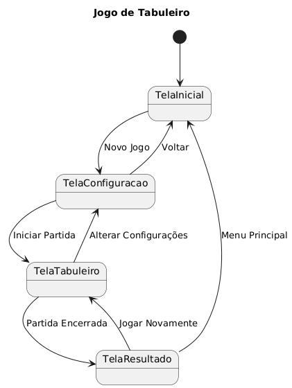

# 2º Projeto POO

## Estrutura dos diretórios

- `special/` - Contém dados de documentação/dados relacionados ao projeto, como diagramas UML e PDFs.

## Esboços e Diagrama UML

## Esboços

Os esboços em PDF se encontram [em special/esbocos.pdf](special/esbocos.pdf).

## Diagrama UML do projeto

[PDF](special/esbocos.pdf)
[Arquivo PlantUML](special/diagrama.pu)

## Instruções de instalação

Se necessário, crie um ambiente virtual:

`python3 -m venv poo_env`

Ative o ambiente virtual:

`./poo_env/bin/activate`

Depois, instale os pré-requisitos:

`pip install -r requirements.txt`

## Instruções de utilização

Com o ambiente virtual ativo, execute o comando:

`python main.py`

# Uso demLLMs

- ChatGPT (GPT-5.5-Instant): *Troubleshooting* da sintáxe PlantUML (PlantText), que foi a ferramenta de renderização utilizada para criação do diagrama vinculado ao projeto.